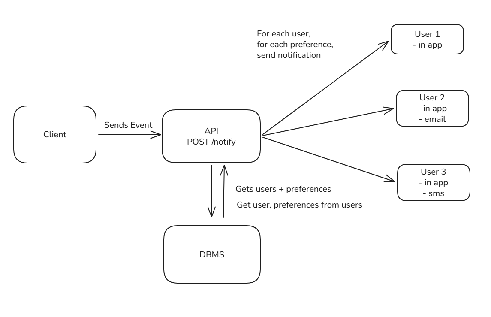
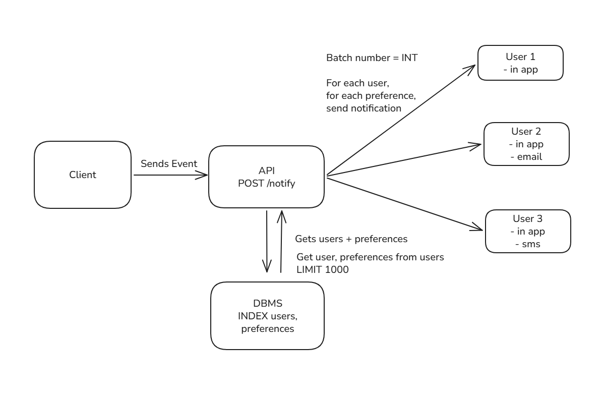
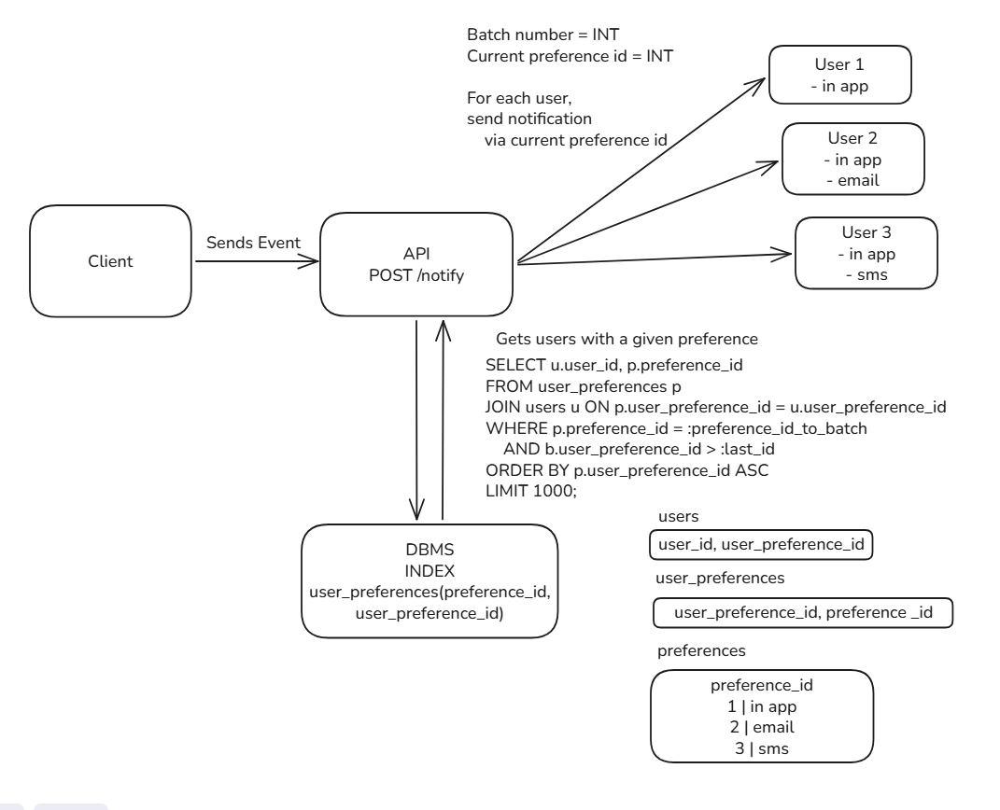

# MISSION
Build an internal notification platform that receives product events, determines which users should be notified, respects user preferences, and delivers notifications through supported channels such as in-app, email, SMS, or push.

## Problem statement:
A user wishes to alert one or many people on something that has occured. There is cognitive and mechanical overhead of finding a means to have the target user(s) notified. What way are they receiving the message? How do we know they've received it or have seen it? What if we have many people we want to tell? What if they, or some of them, don't use the existing platform that notifications are being sent out to?

## User stories
- A user recieves a notification
- A user does not recieve a notification on desired platform
  - System retries to send notification
- A user leaves the notification unread
- A user consumes a notification
- A user turns notifications off
- A user chooses one or more platforms to recieve notifications

## Function Requirements
-  The system must be able to receive an event
-  The system must be able to identify the recipients a notification goes to
-  The system must respect a user's notification preferences
-  In app notifications must be supported in V1
-  The system must retry to send a notification if it fails to send
-  Read/unread stats must be tracked
-  The system must not send a duplicated notification to the same user on a single platform
-  The system can optionally support SMS/Email/push delivery channels

## Non-Functional Requirements
- In-app notifications should appear quickly, within a few hundreds of milliseconds to a few seconds
- Out of app notiifcations should be handled asynchronously, and be eventually consistent
- The system should be not slow main product flow
- Delivery failures should be observable
- The system should be able reliable enough as to not lose events
- User preferences and notifications data must be access controlled
- For a single user, notifications should usually be displayed in order of created_at. Exact global ordering is not required
  
## Out of scope for V1:
- Moderator dashboard
- Full analytics
- Mobile-Specific UX
- Multi-tenant external platform
- Exact global ordering

# System Design
Mission: Recieve an event, and send it to all users through their preferred channel

Creating a user is much less common than reading users and their preferences, so we'll focus on optimising for reads when it comes to the database and processing information. 

We should also push notifications to users to allow their preference method handle storing the information rather than holding a store and having the users preference methods to poll. This also allows easier integrations for the platform, and lets us keep an API architecture where we don't have to keep any lines open, delivering messages as soon as we can.

## V1:

There's quite a lot of processing, to go through each user and create a notification.
Getting the full set of users and storing their data in memory seems expensive here, can we break it up into chunks and asynchronously process it?

Lets create a batching process, and process each batch, keeping track of where we were last and using an offset for the next.

## V2:

The bottleneck now doesnt solely lay on a single payload from reading the database and holding it in memory, and retries are easier to process.

The API, while still has a lower set of information to process each time, still needs to process before the next batch happens.

It seems to be a good idea to keep batches, as well as have preferences stored in a seperate table with a bridge table to record which user prefers which channel. `limit` happens after `group by` and `order_by` however, so a decision with batching needs to happen. A nice side-effect though is that we can also optimise to deliver in app first, and hand off other methods to another process.

We can cut up the SQL query. Process batches in-app first using `where`, then later after the event has completed, do the other methods. The issue here is that we'll have to filter the whole table and discard that 'view' each batch. Lets index this bridge table, and query for the in-app `preference_id`, then handling the remaining preferences after that's done.

## V3:

This is going to allow us to have quick batching, without the risk of losing a lot of processing time when a failure occurs on large payloads. 

The variable in the sql `:preference_id_to_batch` will be the preference type we want to collect `users` by. We'll also get the preferences table and hold that in memory as a list (skipping over the in-app ID) to keep track of where we are regarding the notification method, as it's not guaranteed the id's will always be incrementing by a single value (such as deleted rows). We'd move down a row when the final batch of a preference is processed, ie the latest batch had less than 1000 entries.

The issue still lies in the API having to finish each call before each iteration, but now we can pioritise preferences.

## V4:

We can take the load off the API processing the preference by offloading the work into an asynchronous process and another service. We can use a queue service and another server to handle this, freeing up the API server.

Queue services can be from cloud services or in bespoke services, its main function is to collect the messages with the `user_id` and required information. The notification sending server can be very small, as it only needs to recieve the information and process each message through the method the preference requires, so a serverless function can fit.

## Further scaling options:
We could consider using a cache in front of the database, but this can be an issue when handling a new user signing up. It's difficult to answer when a cache should clear based on events that are out of our control. With the current optimisation it might be better to use database read only replicas with the speed of the query to rely on.

Further optimisations would include scaling up the notification sending services with replicas since that would be where the current load looks where it could be. This would move the bottleneck into the queue service, as only 1 queue is sending messages to more than 1 server. Since each message holds its own state, it's not an issue to determine which queue a message gets sent to. This can be done to handle inceased traffic, hotspots, manage failures.

For further scaling, using a load balancer to route to replicas of API servers, routing to the read replica databases. Automatic sharding for relational databases can be utilised through cloud services as well.