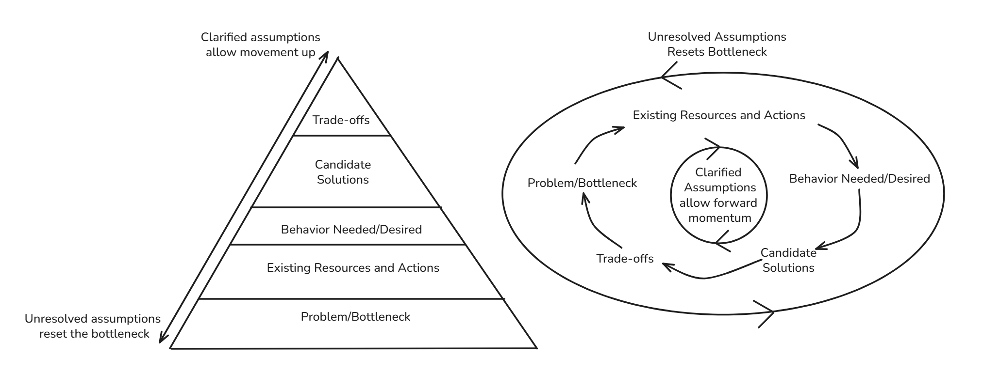

# What I learnt from this investigation
## Product investigation
  - I found more clarity around scoping work for a V1
  - I thought there was a lot more to do, but there's limits for deliverables in functional and non-functional requirements we can impose
  -  How fast do we want it to be? What's reasonable? It can be hard to say a precise number, giving a magnitude of the measure is a good idea
  - Scope creep can literally creep in, be aware of what is needed and what is nice to have.
  - Also should consider what needs to be down NOW with the system, and what can be done later. Critical paths lead the initial design.
  - Writing this all out really opened me up to what I don't know when I need to talk and explain it in a context
  - It's important to find ways that give me the energy to move through this work, rather than trying to force myself to do another course

## System design
  - Really ask about the context, how is this fitting in a real world scenario?
  - Ask about the information we're getting into the system, is any of it usable for us to avoid adding work in our system?
  - Prioritise avoiding having the system do work before optimising the effort to do the work
  - Solve for now, leaving the design to evolve for tomorrow
  - Avoiding work on the database beats optimising the query 
  - Stop work processes as early as possible
  - Notifications are not both the delivery and the notification, splitting up action and object is important. Observing the Delivery and the Notification seperately clarified the domain model
  - We can seperate the same process based on its functional differences, such as seperating the delivery of notifications to a sms channel, in-app channel, etc
  - Unknown domains can be approached, questioning what it needs to do, the information it uses and abstracting them to constructs can give us an idea on how to approach handling aspects of the domain.
  - Language is important for talking about user added data. We don't override, but rather we apply policies to ensure usability and serving needs for the situation.
  - Having async channels for the delivery methods doesnt reduce total work, but allows isolation and customisation on each channel.
  - Workers are not a technology, rather a role, aimed to complete specific tasks, and in this design very useful for carrying out each channel's delivery method
    - There could be other constructs that we can leverage with this idea of isolation and responsibility
  - Approaching designing with these questions makes the process less ambiguous:
      1. What problem exists?
      2. Whats our data and what operations need to happen?
      3. What behaviour solves that problem?
      4. What implementation provides that behaviour?
      5. What trade-offs does that implementation make?

## DS/A investigation
  - As I learn more on how to approach problems, the more I can condense my information, being more concise
  - Hash Maps and Sets are great for accessing an item when we know the key, MinHeaps can help us if we need to access based on the lowest value
    - MaxHeaps would be the alternative, for access on the largest value item
  - Similar to the Workers in the System Design part, there's a role and implementation seperation in DS/A. Priority queues to order retries based on a `next_retry_at` `datetime` value can be implemented through a MinHeap.
  - Approaching with `Problem -> Behaviour -> Implementation -> trade-offs` makes these questions much more manageable, like it does with system design
    - 

# My Assumptions that were challenged
(or "Things I was wrong about")

What assumption was I making?
What observation disproved it?
What new model replaced it?
## I assumed I needed to fan all notifications to all users
I made an assumption initially that the mission of the platform was to send all notifications to all users.
This meant I went to create a system that fanned all messages out to every user that accepted that delivery method (sms, email, in-app)

Later on, I discovered that it was more nuanced. The notification depended on what event needed to be processed, which also affected what delivery channel was used, and which users the notification would be delivered to.

This completely changed the direction of the System Design. The scaling needed to be thought of differently.

## I assumed that DS/A questions had special tricks to them
I thought that interview questions around DS/A mainly questioned if I had done enough to pick out the trick for the question. I was wrong.

It was to see if I could understand the problem this DS/A question was suffering on, what's its bottleneck? 

What's the issue we're looking at? Do we need fast lookups? Are we concerned about storage size? Are we looking for a sequence in an array? Are we trying to find the smallest item to take action on in a set of items?

This lead to me asking the question "How do we find the the events we've stored in our deduplication set that have expired to clean up?"

Naturally, this lead to "Using a MinHeap". The relation exists, I just had to find the question to ask first.

The most important discovery was that I did not need to know a MinHeap beforehand. I needed to understand the problem well enough to ask what information was important to access quickly. Once I realised I needed the earliest expiry time, a MinHeap became a natural candidate. The data structure was a consequence of the problem rather than the starting point.